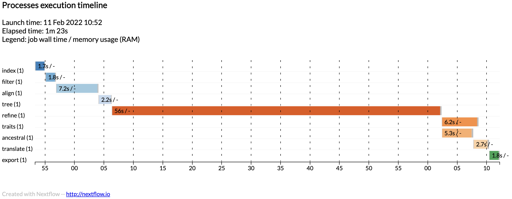
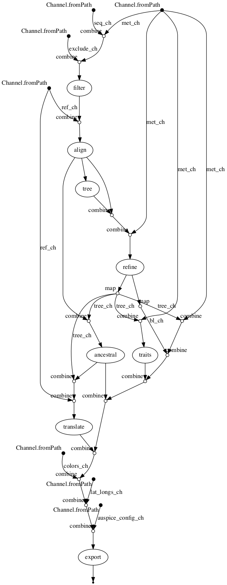

# Nextstrain build for Zika virus tutorial

This repository provides the data and scripts associated with the [Zika virus tutorial](https://nextstrain.org/docs/getting-started/zika-tutorial).

See the [original Zika build repository](https://github.com/nextstrain/zika) for more about the public build.

This repo is a conversion of the standard Snakemake workflow into [Nextflow](https://www.nextflow.io/).

As a potential joint effort, the [nf-core](https://nf-co.re/) community attempts to collect and curate nextflow analysis pipelines. Their slack channel is very active and provides insight on design decisions of the dsl. Their github provides a workflow template and github action linters.

## Demonstration

Augur commands were wrapped in processes (similar to Snakemake's rules) and placed in the `modules/augur.nf`. Nextflow processes were imported into `main.nf` and connected via Nextflow channels.

```
sequence_ch | index |                                       // INDEX
  combine(metadata_ch) | combine(exclude_ch) | filter |     // FILTER
  combine(reference_ch ) | align |                         // ALIGN
  tree |                                                   // TREE
  combine(align.out) | combine(metadata_ch) | refine        // REFINE
...
```

See `main.nf` for full details.

To run the workflow:

```
# (1) Install nextstrain or activate the nextstrain conda environment
conda activate nextstrain

# (2) Install nextflow via conda or mamba
conda install -c bioconda nextflow

# (3) Place the input files in the current directory in a "data" folder

# (4) Run pipeline on a set of input files
nextflow run nextstrain/zika-tutorial-nextflow \
         --sequences "data/sequences.fasta" \
         --metadata "data/metadata.tsv" \
         --colors "data/colors.tsv" \
         --auspice_config "data/auspice_config.json" \
         --lat_longs "data/lat_longs.tsv" \
         --colors "data/colors.tsv" \
         --exclude "data/dropped_strains.txt" \
         --reference "data/zika_outgroup.gb" \
         -resume

#> Launching `nextstrain/zika-tutorial-nextflow` [loving_heyrovsky] - revision: fedd37a247 [master]
#> executor >  local (9)
#> [ce/f98d1c] process > index (1)     [100%] 1 of 1 ✔
#> [15/87647b] process > filter (1)    [100%] 1 of 1 ✔
#> [20/92369c] process > align (1)     [100%] 1 of 1 ✔
#> [73/fc578a] process > tree (1)      [100%] 1 of 1 ✔
#> [d3/d159ed] process > refine (1)    [100%] 1 of 1 ✔
#> [64/8b7613] process > ancestral (1) [100%] 1 of 1 ✔
#> [06/5afae1] process > translate (1) [100%] 1 of 1 ✔
#> [93/1bbdc9] process > traits (1)    [100%] 1 of 1 ✔
#> [6a/592d90] process > export (1)    [100%] 1 of 1 ✔
#> Completed at: 24-Nov-2021 17:54:59
#> Duration    : 1m 3s
#> CPU hours   : (a few seconds)
#> Succeeded   : 9

ls -1 results

#> aa_muts.json
#> aligned.fasta
#> aligned.nwk
#> auspice/tree.json     #<= this one
#> branch_lengths.json
#> filtered.fasta
#> nt_muts.json
#> sequence_index.tsv
#> sequences.fasta
#> traits.json
#> tree.nwk
```

Based on Nextflow's timeline, the `refine` step seems to take the longest.



Nextflow can generate a DAG of the pipeline, although Nextflow's isn't as easy to read as Snakemake's.

<details><summary>See dag.png</summary>



</details>

## Next steps

There are probably many more complicated pre-processing steps in the Snakemake file, and other difficult use cases:

* [ncov/workflow](https://github.com/nextstrain/ncov/tree/master/workflow)
* [ncov/my_profiles](https://github.com/nextstrain/ncov/tree/master/my_profiles)

Other tasks may include: 

* Creating `profile` configurations for conda, docker, and aws.
* Incorporating data pre-processing steps

Other workflow languages include [WDL from the Broad Institute](https://github.com/broadinstitute/cromwell) which runs on Cromwell execution engine. A [WDL instance of the zika pipeline](https://github.com/nextstrain/zika-tutorial/tree/wdl) was created by huddlej.  
